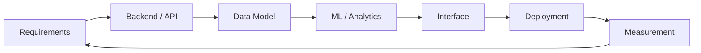

<div align="center">


<br />

[](https://rohitsuryaa.com)
[](https://www.linkedin.com/in/rohit-suryaa-saravanan-197b33303/)
[](mailto:Rohitsuryaas21@gmail.com)

</div>

---

## Control Room

```text
SYSTEM      Rohit Suryaa Saravanan
LOCATION    Fulda, Germany
FOCUS       Software engineering + data systems + applied ML
CURRENT     MSc Data Science @ Hochschule Fulda
SIGNAL      C#/.NET, Blazor, Python, SQL, ML, embedded control logic
MISSION     Build systems that are reliable, explainable, and useful.
```

I build software where backend logic, data workflows, machine learning, and interfaces have to work together. Recently I have been expanding that into embedded-style control systems: operator inputs, safety states, HMI feedback, and validation.

---

## Mission Deck

<table>
  <tr>
    <td width="50%">
      <h3>Embedded Vehicle Control</h3>
      <p>PRINOTH-style vehicle-control demonstrator with operator input handling, HMI state display, safety-state logic, CAN-style message simulation, and validation docs.</p>
      <p><b>Stack:</b> C/C++, ESP32, state machines, HMI, CAN simulation</p>
      <a href="https://github.com/srohitsuryaa21/embedded-vehicle-control">Open repository</a>
    </td>
    <td width="50%">
      <h3>Portfolio System</h3>
      <p>Modern Blazor WebAssembly portfolio with interactive project stack, role-fit scanner, bilingual content, and GitHub Pages deployment.</p>
      <p><b>Stack:</b> C#, Blazor, .NET, JavaScript, GitHub Actions</p>
      <a href="https://github.com/srohitsuryaa21/rohit_portfolio_website">Open repository</a>
    </td>
  </tr>
  <tr>
    <td width="50%">
      <h3>Windmill Pitch Prediction</h3>
      <p>Applied ML research project using time-series features and XGBoost to improve turbine pitch prediction and modeled power output.</p>
      <p><b>Signal:</b> 96% accuracy, 2.3% modeled error, +21% power output</p>
      <a href="https://github.com/srohitsuryaa21/windmill-pitch-prediction">Open repository</a>
    </td>
    <td width="50%">
      <h3>Supply Chain Intelligence</h3>
      <p>Analytics and forecasting pipeline for e-commerce operations, demand planning, delivery analysis, and seller risk scoring.</p>
      <p><b>Stack:</b> Python, SARIMA, XGBoost, Plotly Dash, analytics</p>
      <a href="https://github.com/srohitsuryaa21/supply-chain-forecasting">Open repository</a>
    </td>
  </tr>
</table>

---

## Systems I Like Building



---

## Toolkit

<div align="center">


</div>

---

## Live Signals

<div align="center">


</div>

---

## Contribution Game

<picture>
  <source media="(prefers-color-scheme: dark)" srcset="https://raw.githubusercontent.com/srohitsuryaa21/srohitsuryaa21/output/github-contribution-grid-snake-dark.svg" />
  <source media="(prefers-color-scheme: light)" srcset="https://raw.githubusercontent.com/srohitsuryaa21/srohitsuryaa21/output/github-contribution-grid-snake.svg" />
  
</picture>

---

## Current Role Targets

```text
01  Software Developer       C# / .NET / Blazor / REST APIs
02  Backend Developer        APIs / databases / reliability
03  Data Engineer            SQL / pipelines / dashboards
04  Machine Learning         XGBoost / time series / explainability
05  Embedded Systems         C/C++ / state machines / HMI / validation
```

---

<div align="center">

<b>Reliable software. Intelligent data systems. Useful engineering evidence.</b>

</div>
